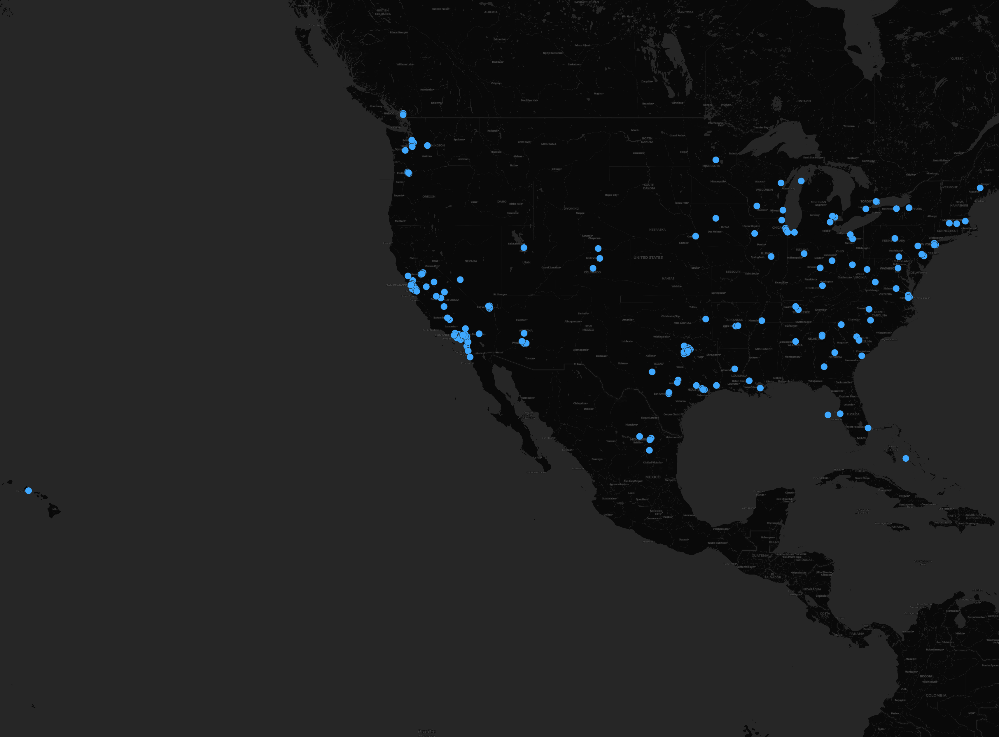

# Lab 2 Assignment

### Geo-Tagged Tweets within the United States with the Keyword 'Playlist'

This map depicts tweets across the United States that are related to the keyword 'playlist'. Using a Twitter API crawler, tweets with attributed geographic locations were collected and then mapped using QGIS. 

In analyzing the tweets that are shown, it is clear that the West and East Coasts are the locations in which there are the most tweets pertaining to playlists. While the Twitter Crawler is not an all encompassing API, there is enough data to find patterns in geography. The Industrial Midwest is more spread out in terms of tweets, while the center left of the United States, which contains Montana and Idaho, shows little interest in designated topic with little to no tweets.
